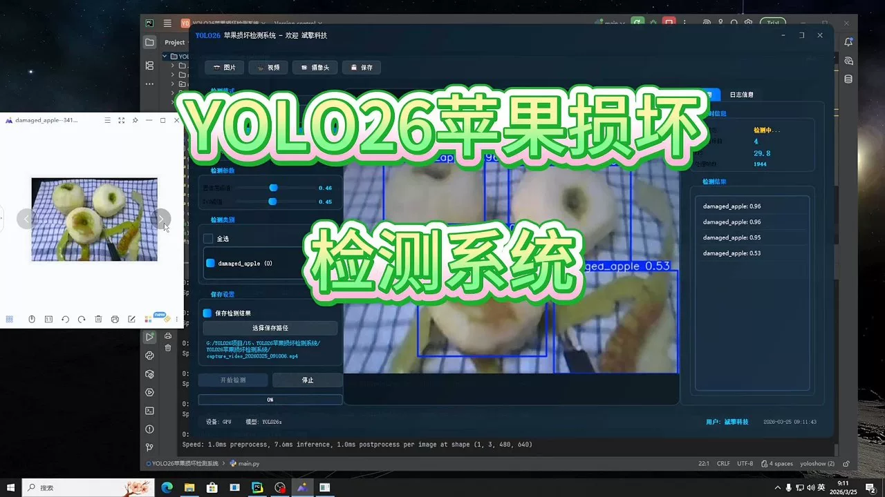
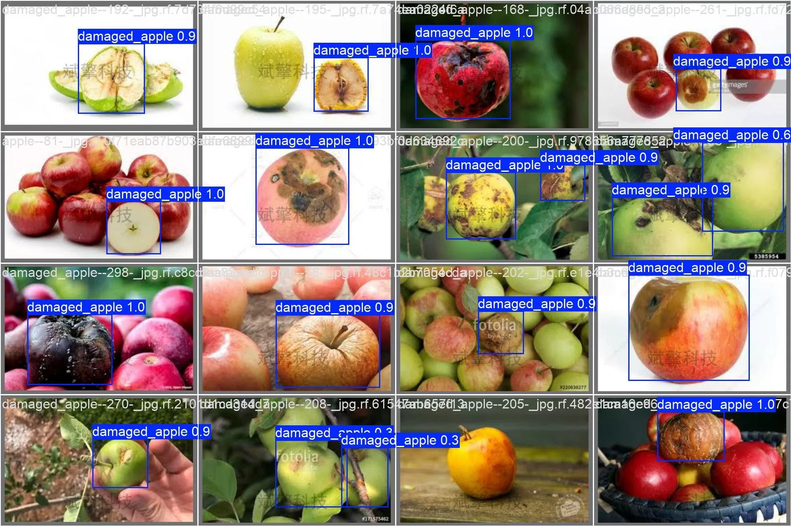
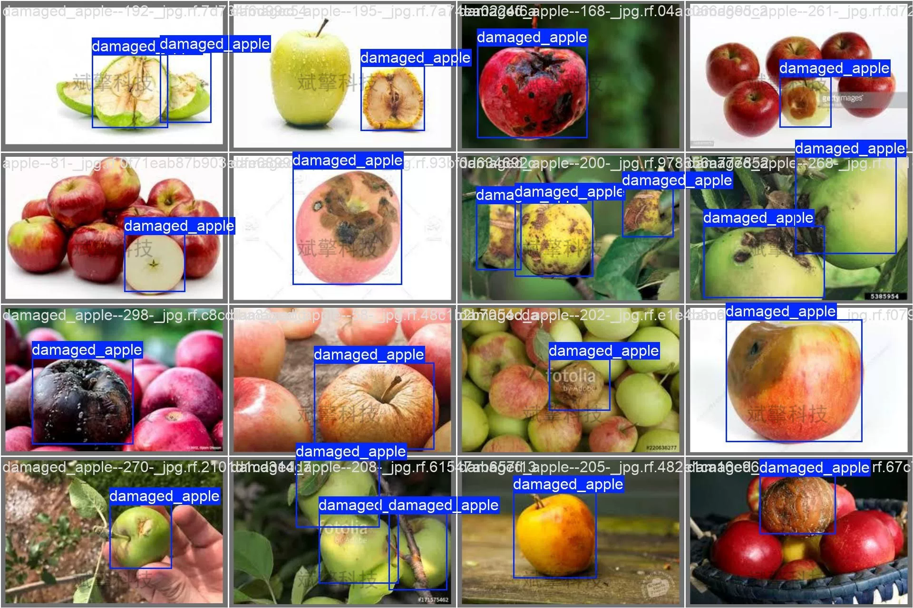
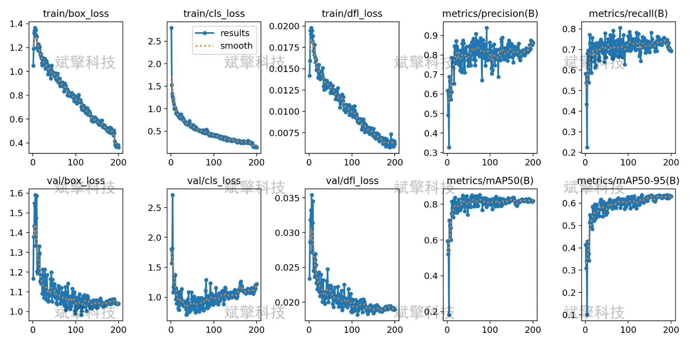
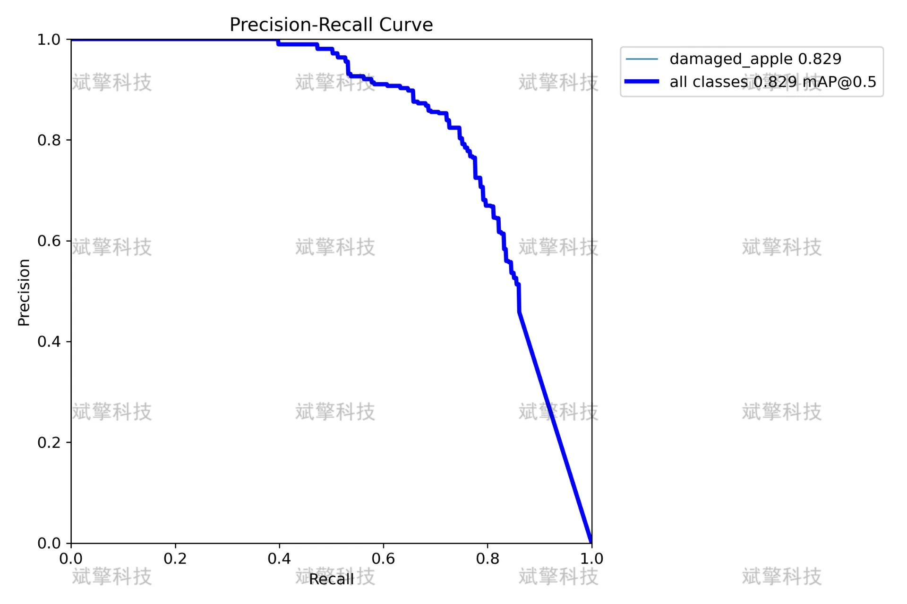
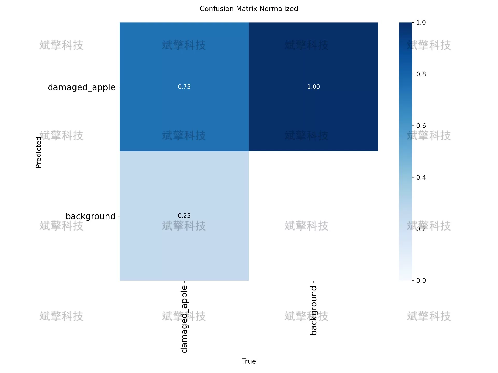
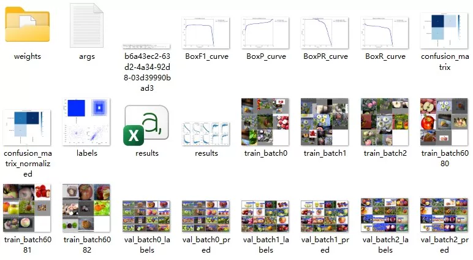
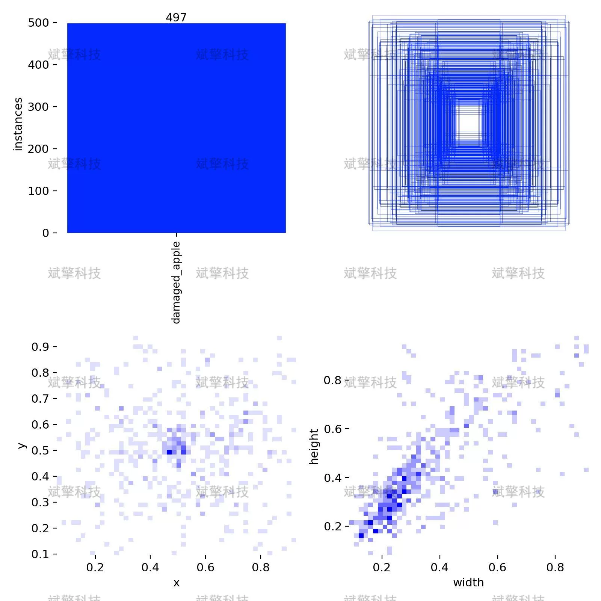

# YOLOv26 Apple Damage Detection System | UI Interface

## Body

YOLO26 Apple Damage Detection System | UI Interface

This article introduces a YOLO26-based apple damage detection system for the automation of identifying and localizing damaged apples. The system employs a single-class object detection approach, training and validating only on the "damaged_apple" category. The experiments used 356 labeled images (253 in the training set and 103 in the validation set), trained on an NVIDIA RTX 4090 D GPU. The validation results show that the model achieves an average precision (mAP50) of 82.9% at an IoU=0.5 threshold, with a comprehensive accuracy of 82.4%, and a recall rate of 74.6%. A confusion matrix analysis indicates that the model has a correct detection rate of 75% for damaged apples, with no false positives, but there is a 25% missed detection rate. The system's inference speed per image is 7.9ms, meeting the requirements for real-time detection. This study provides a feasible technical solution for automated quality control of apples.
The "damaged_apple" category encompasses various forms of apple damage, including but not limited to:
Mechanical damage (collision, compression)
Rotten spots
Insect damage marks
Surface damage
Free reservation for remote installation. Unsuccessful installation will result in a full refund.
Purchase comes with the following resources (unlocked by Baidu Cloud):
YOLO recognition detection project complete source code
YOLO format dataset
Training code + UI interface code
Trained model + results images
Software installer
Add WeChat to make a reservation for remote installation (automatically displayed WeChat ID after purchase) - Unsuccessful, full refund guaranteed.

⚙️ Core Function Modules
Detection Capability
Image detection: upload and detect immediately, returning detection boxes + category information
Video detection: supports video files, analyzing each frame accurately
Camera real-time detection: connects to USB cameras to achieve dynamic monitoring
Interaction and Control
Target selection: freely choose one or more categories for detection
Parameter real-time adjustment: adjustable confidence threshold & IoU threshold, flexibly controlling accuracy
Result saving: one-click save of images/videos/camera detection results
System and Data
User login registration: supports password strength checking + encryption storage
Log recording: automatically records operation and error information (timestamped)

## Images

## Payment

Here is a pay link on Stripe ( https://buy.stripe.com/3cs8yP7sY87d0vu9AB ). Please contact me lonlonago@foxmail.com after funding $89, and I will send you a complete data files , thank you!

